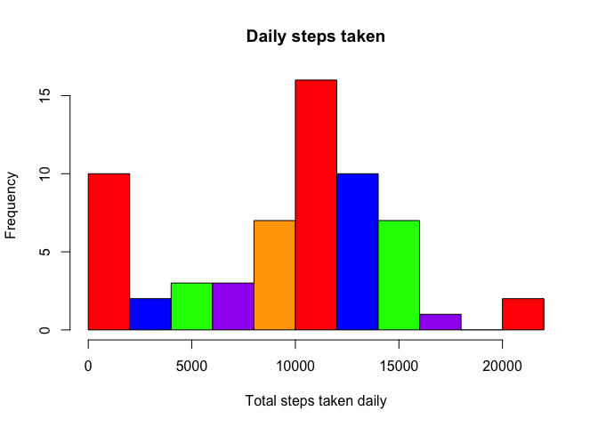
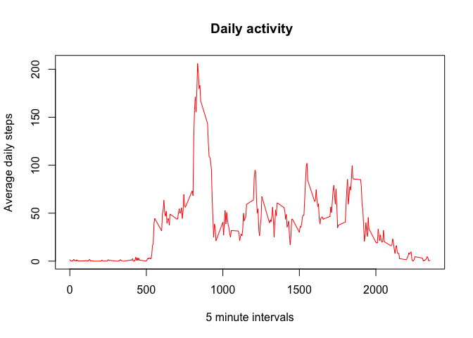
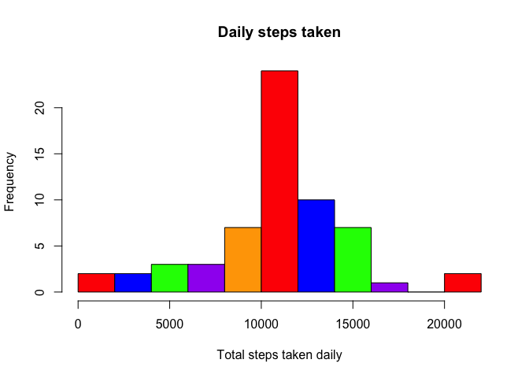
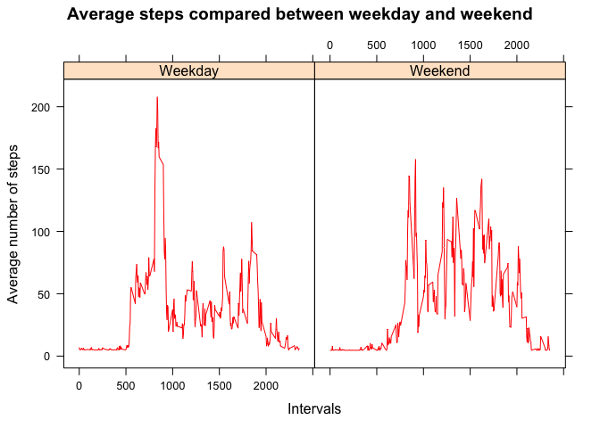

Loading libraries used in this analysis


## Loading and preprocessing the data

```r
origdata <- read.csv("activity.csv")
head(origdata)
```

```
##   steps       date interval
## 1    NA 2012-10-01        0
## 2    NA 2012-10-01        5
## 3    NA 2012-10-01       10
## 4    NA 2012-10-01       15
## 5    NA 2012-10-01       20
## 6    NA 2012-10-01       25
```

```r
## Observation: No processing/tranforming data required at this point.
```

## Question: What is mean total number of steps taken per day?  
**Note we can ignore na values for this question**  
1. Make a histogram of the total number of steps taken each day  
2. Calculate and report the **mean** and **median** total number of steps taken per day

```r
daily_sum <- tapply(X = origdata$steps, INDEX = origdata$date,  FUN = sum, na.rm = TRUE)
med <- median(daily_sum)
mea <- mean(daily_sum)

hist(daily_sum, xlab = "Total steps taken daily", main = "Daily steps taken", 
     col = c("red", "blue", "green", "purple", "orange"), breaks = 10)
```

<!-- -->

```r
print(paste("Mean of the original data is", mea, "and the median of this is", med))
```

```
## [1] "Mean of the original data is 9354.22950819672 and the median of this is 10395"
```

## What is the average daily activity pattern?
1. Make a time series plot (i.e. `type = "l"`) of the 5-minute interval (x-axis) and the average number of steps taken, averaged across all days (y-axis)
2. Which 5-minute interval, on average across all the days in the dataset, contains the maximum number of steps?

```r
daily_average <- tapply(X = origdata$steps, INDEX = origdata$interval,  FUN = mean, na.rm = TRUE)
plot(names(daily_average), daily_average, type = "l", xlab = "5 minute intervals", ylab = "Average daily steps", col = "red", main = " Daily activity")
```

<!-- -->

```r
max_interval <- names(which.max(daily_average))
max_steps <- max(daily_average)

print(paste("At interval", max_interval, "the max daily average for this trial period is", max_steps))
```

```
## [1] "At interval 835 the max daily average for this trial period is 206.169811320755"
```

## Imputing missing values
1. Calculate and report the total number of missing values in the dataset (i.e. the total number of rows with `NA`s)
2. Devise a strategy for filling in all of the missing values in the dataset. The strategy does not need to be sophisticated. For example, you could use the mean/median for that day, or the mean for that 5-minute interval, etc.
3. Create a new dataset that is equal to the original dataset but with the missing data filled in.
4. Make a histogram of the total number of steps taken each day and Calculate and report the **mean** and **median** total number of steps taken per day. Do these values differ from the estimates from the first part of the assignment? What is the impact of imputing missing data on the estimates of the total daily number of steps?

```r
total_missing <- sum(is.na(origdata$steps))
print(paste("There are a total of", total_missing, "missing values"))
```

```
## [1] "There are a total of 2304 missing values"
```

```r
# Strategy for missing values: Mean of mean, set NA to that value.
newdata <- origdata
newdaily_mean <- tapply(X = origdata$steps, INDEX = origdata$date,  FUN = mean, na.rm = TRUE)
mean_of_mean <- mean(newdaily_mean, na.rm = TRUE)
print(paste("The mean of all of the averages (mean of means) of the daily walks is", mean_of_mean, "and will be used to fill the NA values"))
```

```
## [1] "The mean of all of the averages (mean of means) of the daily walks is 37.3825995807128 and will be used to fill the NA values"
```

```r
newdata$steps[is.na(newdata$steps)] <- mean_of_mean
head(newdata)
```

```
##     steps       date interval
## 1 37.3826 2012-10-01        0
## 2 37.3826 2012-10-01        5
## 3 37.3826 2012-10-01       10
## 4 37.3826 2012-10-01       15
## 5 37.3826 2012-10-01       20
## 6 37.3826 2012-10-01       25
```

```r
# Total number  of steps each day now
daily_sum_new <- tapply(X = newdata$steps, INDEX = newdata$date,  FUN = sum, na.rm = TRUE)

hist(daily_sum_new, xlab = "Total steps taken daily", main = "Daily steps taken", 
     col = c("red", "blue", "green", "purple", "orange"), breaks = 10)
```

<!-- -->

```r
## Observation: It is similar,  but has dramatically altered the outcome of the data.

new_mean <- mean(daily_sum_new)
new_median <- median(daily_sum_new)

print(paste("Mean of the new data is", new_mean, "and the median", new_median))
```

```
## [1] "Mean of the new data is 10766.1886792453 and the median 10766.1886792453"
```

```r
# Impact: Both the median and mean values changed. This can skew results dramatically depending on what is being looked at.
```

## Are there differences in activity patterns between weekdays and weekends?
For this part the `weekdays()` function may be of some help here. Use
the dataset with the filled-in missing values for this part.
1. Create a new factor variable in the dataset with two levels -- "weekday" and "weekend" indicating whether a given date is a weekday or weekend day.
2. Make a panel plot containing a time series plot (i.e. `type = "l"`) of the 5-minute interval (x-axis) and the average number of steps taken, averaged across all weekday days or weekend days (y-axis).

```r
newdata$date <- as.Date(newdata$date)

# Column for day of week
newdata$Day_of_week <- ""
newdata$Day_of_week <- weekdays(newdata$date)

# Conver column day of week into weekend/weekday
newdata$type <- ""
newdata[newdata$Day_of_week == "Saturday",  ]$type <- "Weekend"
newdata[newdata$Day_of_week == "Sunday", ]$type <- "Weekend"
newdata[!(newdata$Day_of_week == "Sunday" | newdata$Day_of_week == "Saturday"), ]$type <- "Weekday"
newdata$type <- as.factor(newdata$type)

table(newdata$Day_of_week)
```

```
## 
##    Friday    Monday  Saturday    Sunday  Thursday   Tuesday Wednesday 
##      2592      2592      2304      2304      2592      2592      2592
```

```r
final_output <- aggregate(steps ~ interval + type, newdata, mean)

xyplot(steps ~ interval | type, data = final_output,
       xlab = "Intervals", ylab = "Average number of steps",
       main = "Average steps compared between weekday and weekend",
       col = "red", type = "l")
```

<!-- -->
